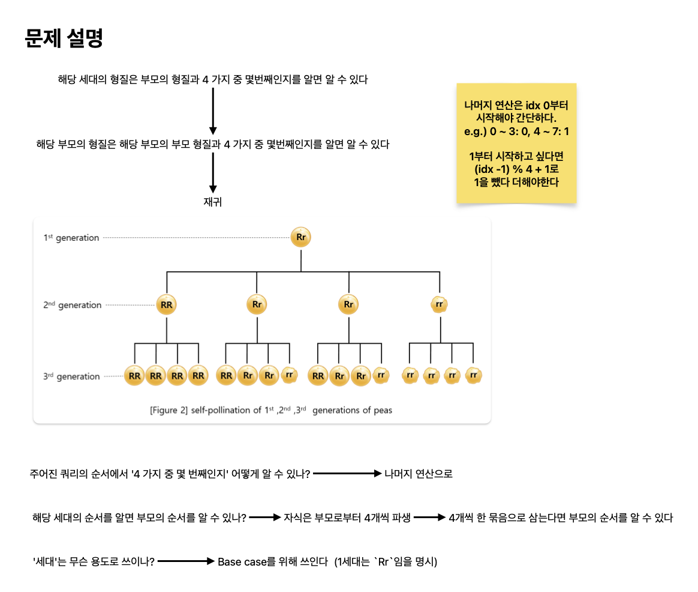

# 유전법칙

[link](https://school.programmers.co.kr/learn/courses/15008/lessons/121685)

멘델은 완두콩을 이용하여 7년간 실험한 결과, 다음과 같은 특별한 법칙을 발견하였습니다.

1. 둥근 완두 순종(RR)을 자가 수분, 즉 같은 유전자끼리 교배할 경우, 다음 세대에 둥근 완두 순종 형질만 나타난다.
1. 주름진 완두 순종(rr)을 자가 수분할 경우, 다음 세대에 주름진 완두 순종 형질만 나타난다.
1. 두 순종을 교배한 잡종(Rr)을 자가 수분할 경우, 다음 세대의 형질은 RR:Rr:rr=1:2:1의 비율로 나타난다. (아래 그림 참조)

진송이는 이러한 완두콩의 자가 수분 실험 결과를 정리하고 싶어합니다. 하지만, 세대를 거듭할수록, 완두콩의 수가 너무 많아져 모든 가계도를 기록하기 어려워졌습니다. 진송이는 가계도를 전부 기록하는 것 대신, 완두콩의 세대와 해당 세대에서 몇 번째 개체인지를 알면 형질을 바로 계산하는 프로그램을 만들려 합니다.

각 세대에서 맨 왼쪽 개체부터 첫 번째, 두 번째, 세 번째, ...개체로 나타냅니다. 예를 들어 그림 2에서 2세대의 네 번째 개체의 형질은 "rr"이며, 3세대의 9번째 개체의 형질은 "RR"입니다.

## What I learned

- 이 문제는 이해하는 데 애먹었지만 원리를 이해하면 단순해서 좋았다.
- 문제의 지시사항에 의존하지 않고 프로그래밍 동작 원리에 맞춰 인덱스를 적절히 변형하는 법을 배웠다. e.g. `첫번째 순서를 idx 0으로 변경`
- 부모의 형질과 해당 자식의 순서를 `if문`으로 처리해도 되지만 심플하게 해시 테이블을 사용해 정리했다.



```python
def solution(queries):
    def get_result(gen, order):
        if gen == 0:
            return "Rr"

        parent = order // 4
        key = get_result(gen - 1, parent)
        return table[key][order % 4]

    table = {
        "RR": ["RR", "RR", "RR", "RR"],
        "Rr": ["RR", "Rr", "Rr", "rr"],
        "rr": ["rr", "rr", "rr", "rr"],
    }

    answer = []
    for gen, order in queries:
        ans = get_result(gen - 1, order - 1)
        answer.append(ans)
    return answer


```
