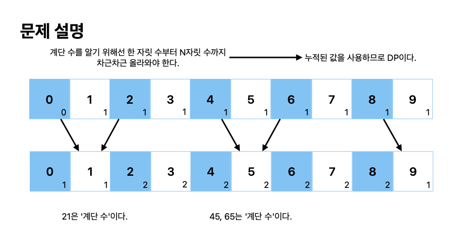

# 쉬운 계단 수

[link](https://www.acmicpc.net/problem/10844)

45656이란 수를 보자.

이 수는 인접한 모든 자리의 차이가 1이다. 이런 수를 계단 수라고 한다.

N이 주어질 때, 길이가 N인 계단 수가 총 몇 개 있는지 구해보자. 0으로 시작하는 수는 계단수가 아니다.



```python
def solve():
    N = int(input())

    dp = [[0] * 10 for _ in range(N + 1)]
    dp[1][0] = 0
    for i in range(1, 10):
        dp[1][i] = 1

    for length in range(2, N + 1):
        for i in range(10):
            if i == 0:
                dp[length][i] = dp[length - 1][i + 1]
            elif i == 9:
                dp[length][i] = dp[length - 1][i - 1]
            else:
                dp[length][i] = (
                    dp[length - 1][i - 1] + dp[length - 1][i + 1]
                ) % 1_000_000_000

    return sum(dp[N]) % 1_000_000_000


ans = solve()
print(ans)
```
