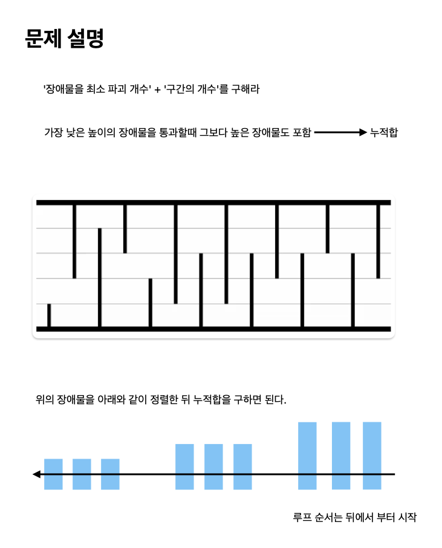

# 개똥벌레

[link](https://www.acmicpc.net/problem/3020)

동굴의 크기와 높이, 모든 장애물의 크기가 주어진다. 이때, 개똥벌레가 파괴해야하는 장애물의 최솟값과 그러한 구간이 총 몇 개 있는지 구하는 프로그램을 작성하시오.

## What I Learned

- 누적합.
- 높이의 시작 위치를 이분탐색으로 찾아 풀 수 있다.
  - 시간 복잡도는 위 아래로 별도로 정렬하면 `100,000 * log 100,000 + 100,000 * log 100,000 == 14,000,000` 이다. 여기서 높이를 이분탐색하면 `500,000 * log 500,000 == 45,000,000` 이다.
  - 최종 시간 복잡도는 `14,000,000 + 45,000,000`으로 1억을 넘지 않는다.



```python
# 가장 낮은 높이의 장애물을 통과할 때 그보다 높은 장애물을 통과
# 기존의 높이를 모아 누적해서 처리
from collections import defaultdict
import sys

input = sys.stdin.readline


def solve():
    N, H = map(int, input().rstrip().split())

    bottom = defaultdict(int)
    top = defaultdict(int)
    for i in range(N):
        val = int(input())
        if i % 2 == 0:
            bottom[val] += 1
        else:
            top[val] += 1

    for i in range(H - 1, 0, -1):
        bottom[i] += bottom[i + 1]
        top[i] += top[i + 1]

    result = defaultdict(int)
    for i in range(H, 0, -1):
        num_obstacles = bottom[i] + top[H - i + 1]
        result[num_obstacles] += 1

    # print(result)
    min_obstacles = min(result.keys())
    num_lines = result[min_obstacles]

    print(min_obstacles, num_lines)


solve()

```

```python
# 가장 낮은 높이의 장애물을 통과할 때 그보다 높은 장애물을 통과
# 높이를 오름순으로 정렬한 뒤, `높이 리스트 길이 - 목표 높이의 시작위치`로 장애물 통과 개수 알 수 있다
from bisect import bisect_left
import sys

input = sys.stdin.readline


def solve():
    N, H = map(int, input().rstrip().split())
    top = []
    bottom = []
    for i in range(N):
        if i % 2 == 0:
            top.append(int(input()))
        else:
            bottom.append(int(input()))

    top.sort()
    bottom.sort()

    min_obstacles = float("inf")
    count = 0
    for h in range(1, H + 1):
        bottom_start, top_start = bisect_left(bottom, h), bisect_left(top, H - h + 1)
        obstacles = len(bottom) - bottom_start + len(top) - top_start
        if min_obstacles > obstacles:
            min_obstacles = obstacles
            count = 1
        elif min_obstacles == obstacles:
            count += 1

    print(min_obstacles, count)


solve()

```
