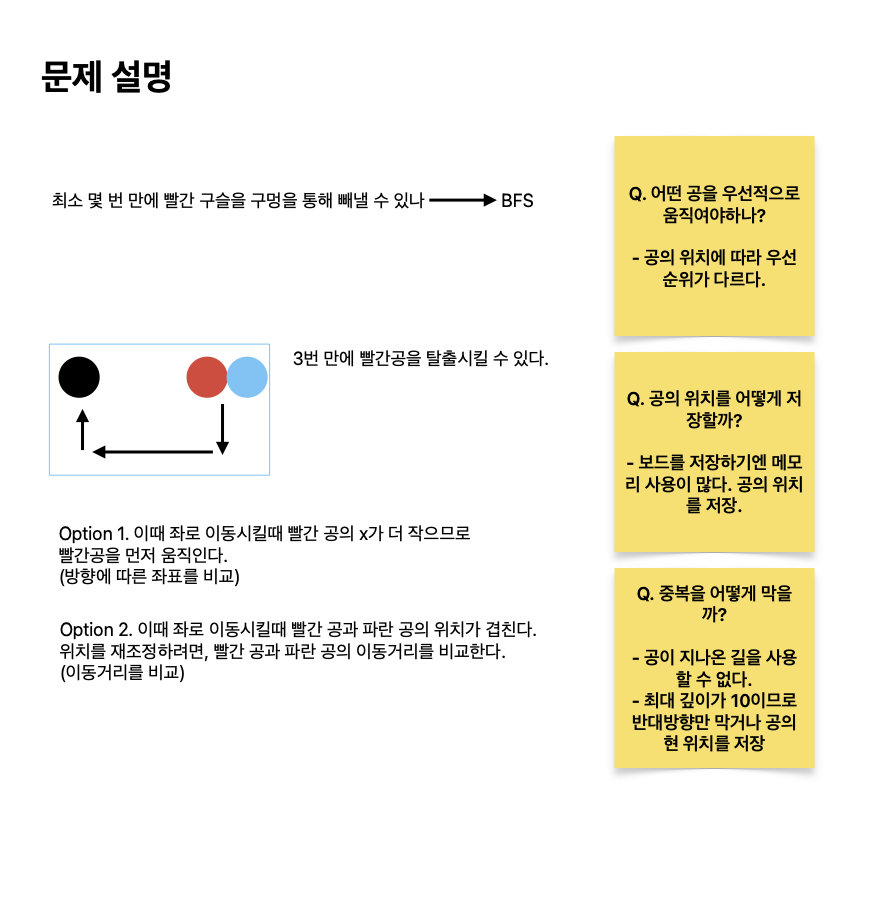

# 구슬 탈출 2

[link](https://www.acmicpc.net/problem/13460)

스타트링크에서 판매하는 어린이용 장난감 중에서 가장 인기가 많은 제품은 구슬 탈출이다. 구슬 탈출은 직사각형 보드에 빨간 구슬과 파란 구슬을 하나씩 넣은 다음, 빨간 구슬을 구멍을 통해 빼내는 게임이다.
...
보드의 상태가 주어졌을 때, 최소 몇 번 만에 빨간 구슬을 구멍을 통해 빼낼 수 있는지 구하는 프로그램을 작성하시오.



## What I learned

- 관점의 차이로 인해 코드가 얼마나 단순해지는지 배울 수 있었다: 좌표로 바라보느냐(option 1) vs 상대적인 공의 위치로 바라보느냐(option 2)
- 전체적인 진행순서는 좌표로 바라봤을때 파악이 쉬웠다. 그러나 하나가 변할때 연속적으로 뒤따르는 변화가 많았다. 반면에 공의 입장에서 전반적인 흐름을 파악하기 쉽지 않지만 그에 뒤따르는 변화는 단순했다.
- 따라서 좌표로 우선 전반적인 흐름을 파악하고, 트리거인 요소의 입장에서 흐름을 개편하는 게 좋다.

Q. 탐색을 할때 어떻게 중복을 제거할 것인가?

- option 1. 탐색 깊이가 최대 10이므로 내가 왔던 방향의 반대 방향을 제외한 모든 방향을 탐색한다. `[상, 좌, 우, 하]`와 `if i == 3 - direction`으로.
- option 2. 빨간공과 파란공의 현위치를 기준으로 중복 방지. `if (red, blue) not in visited`으로.

Q. 어떤 공을 우선시해서 움직여야할까?

- option 1. 진행방향의 `y`, `x`를 비교해 공의 우선순위를 정할 수 있다. 예를들어, 윗방향으로 움직일때 `y`가 더 작은 공을 우선 움직인다. 주의할 점은 우선 움직인 공의 위치를 `grid`에 저장해야 뒤따라온 공이 겹치지 않는다. 모든 공을 움직였다면 다시 `grid`를 초기화해야한다.
- option 2. 공이 움직인 수를 센다. 공이 겹쳤을때 더 많이 움직였다면 뒤따라온 공이다.

Q. 매 순간의 `grid`를 저장하기엔 메모리 사용이 많다. 어떻게 절약할까?

- 빨간공과 파란공이 항상 하나씩만 주어지기 때문에 공의 위치를 저장하고, `grid`는 벽과 출구만 남겨놓고 비워놓자.

First Try:

- 좌표로 바라봤을때 진행방향에 따라 고려해야할 요소가 상당히 많았다
- `def move()`는 공의 움직이는 방향에 따라 어떤 공을 우선 움직일지 결정 및 진행한다.

```python
from collections import deque
import sys

input = sys.stdin.readline


dy = [-1, 0, 0, 1]
dx = [0, -1, 1, 0]


def move(grid, direction, red, blue):
    def run(first, second):
        balls = []
        for ball in [first, second]:
            y, x = ball
            grid[y][x] = "b"  # ball
            ny, nx = y + dy[direction], x + dx[direction]
            # manage ny, nx, not y, x..
            while 1 <= ny < N - 1 and 1 <= nx < M - 1 and grid[ny][nx] == ".":
                grid[ny][nx] = grid[y][x]
                grid[y][x] = "."
                y, x = ny, nx
                ny, nx = ny + dy[direction], nx + dx[direction]

            # print("debug", direction, ball)
            # for row in grid: print(row)

            if grid[ny][nx] == "O":
                balls.append((ny, nx))
                y, x = ny - dy[direction], nx - dx[direction]
                grid[y][x] = "."
            else:
                y, x = ny - dy[direction], nx - dx[direction]
                balls.append((y, x))

        for y, x in balls:
            if grid[y][x] == "b":
                grid[y][x] = "."

        return balls

    N, M = len(grid), len(grid[0])

    first, second = None, None
    if direction == 0:
        if red[0] < blue[0]:
            first, second = red, blue
            new_red, new_blue = run(first, second)
            return (new_red, new_blue)
        else:
            first, second = blue, red
            new_blue, new_red = run(first, second)
            return (new_red, new_blue)
    elif direction == 1:
        if red[1] < blue[1]:
            first, second = red, blue
            new_red, new_blue = run(first, second)
            return (new_red, new_blue)
        else:
            first, second = blue, red
            new_blue, new_red = run(first, second)
            return (new_red, new_blue)
    elif direction == 2:
        if red[1] < blue[1]:
            first, second = blue, red
            new_blue, new_red = run(first, second)
            return (new_red, new_blue)
        else:
            first, second = red, blue
            new_red, new_blue = run(first, second)
            return (new_red, new_blue)
    elif direction == 3:
        if red[0] < blue[0]:
            first, second = blue, red
            new_blue, new_red = run(first, second)
            return (new_red, new_blue)
        else:
            first, second = red, blue
            new_red, new_blue = run(first, second)
            return (new_red, new_blue)


def bfs(grid, red, blue):
    queue = deque([(red, blue, 0, 4)])

    while queue:
        red, blue, count, direction = queue.popleft()
        if count == 10:
            continue

        for i in range(4):
            if i == 3 - direction:
                continue

            new_red, new_blue = move(grid, i, red, blue)
            if grid[new_blue[0]][new_blue[1]] == "O":
                continue
            elif grid[new_red[0]][new_red[1]] == "O":
                return count + 1

            queue.append((new_red, new_blue, count + 1, i))

    return -1


def solve():
    N, M = map(int, input().rstrip().split())

    red, blue = None, None
    grid = []
    for i in range(N):
        row = list(input().rstrip())
        grid.append(row)
        for j in range(M):
            if row[j] == "R":
                red = (i, j)
                grid[i][j] = "."
            elif row[j] == "B":
                blue = (i, j)
                grid[i][j] = "."

    return bfs(grid, red, blue)


ans = solve()
print(ans)
```

Second Try:

- 다른 사람의 모범답안을 참조해 기존 코드를 리펙토링했다. 공의 위치를 기반으로 중복방지를 했으며, 공의 위치가 같을때 움직인 수로 위치를 재조정했다.

```python
from collections import deque
import sys

input = sys.stdin.readline


dy = [-1, 0, 0, 1]
dx = [0, -1, 1, 0]


def move(grid, direction, red, blue):
    N, M = len(grid), len(grid[0])

    balls = []
    for y, x in [red, blue]:
        ny, nx, cnt = y + dy[direction], x + dx[direction], 0
        while 1 <= ny < N - 1 and 1 <= nx < M - 1 and grid[ny][nx] != "#":
            cnt += 1
            y, x = ny, nx
            ny += dy[direction]
            nx += dx[direction]
            if grid[y][x] == "O":
                break
        balls.append((ny - dy[direction], nx - dx[direction], cnt))

    new_red, new_blue = balls
    # print("balls: ", balls)
    if (
        new_red[0] == new_blue[0]
        and new_red[1] == new_blue[1]
        and grid[new_red[0]][new_red[1]] != "O"
    ):
        if new_red[2] > new_blue[2]:
            new_red = (
                new_red[0] - dy[direction],
                new_red[1] - dx[direction],
                new_red[2],
            )
        elif new_red[2] < new_blue[2]:
            new_blue = (
                new_blue[0] - dy[direction],
                new_blue[1] - dx[direction],
                new_blue[2],
            )

    return (new_red[:2], new_blue[:2])


def bfs(grid, red, blue):
    queue = deque([(red, blue, 0)])
    visited = set([(red, blue)])

    while queue:
        red, blue, count = queue.popleft()
        if count == 10:
            continue

        for i in range(4):
            new_red, new_blue = move(grid, i, red, blue)
            # print(new_red, new_blue, i)

            if (new_red, new_blue) not in visited:
                if grid[new_blue[0]][new_blue[1]] == "O":
                    continue
                elif grid[new_red[0]][new_red[1]] == "O":
                    return count + 1

                queue.append((new_red, new_blue, count + 1))
                visited.add((new_red, new_blue))

    return -1


def solve():
    N, M = map(int, input().rstrip().split())

    red, blue = None, None
    grid = []
    for i in range(N):
        row = list(input().rstrip())
        grid.append(row)
        for j in range(M):
            if row[j] == "R":
                red = (i, j)
                grid[i][j] = "."
            elif row[j] == "B":
                blue = (i, j)
                grid[i][j] = "."

    return bfs(grid, red, blue)


ans = solve()
print(ans)
```

Last Try:

- 다시 두번째 솔루션을 리펙토링했다.
- `if depth == 10: break`으로 큐에 담긴 내용과 상관없이 종료했다.
- 빨간공 또는 파란공에 상관없이 공이 움직인 수와 좌표에 따라 공의 위치가 결정된다. 따라서 `def move()`를 단순하게 리펙토링했다.
- `def move()`의 `while loop`를 단순하게 리펙토링했다. 기준은 _다음 위치가 룰을 충족하면서_ 동시에 _현재 위치가 내가 찾는 조건을 충족하는지_ 체크한다.

```python
from collections import deque

# Directions: up, down, left, right
dx = [-1, 1, 0, 0]
dy = [0, 0, -1, 1]

# Function to move the marble until it hits an obstacle or goes out of bounds
def move(x, y, dx, dy):
    count = 0
    while board[x+dx][y+dy] != '#' and board[x][y] != 'O':
        x += dx
        y += dy
        count += 1
    return x, y, count

# Function to perform the breadth-first search
def bfs(rx, ry, bx, by):
    queue = deque([(rx, ry, bx, by, 0)])
    visited = set([(rx, ry, bx, by)])

    while queue:
        rx, ry, bx, by, depth = queue.popleft()

        if depth == 10:
            break

        for i in range(4):
            nrx, nry, rc = move(rx, ry, dx[i], dy[i])
            nbx, nby, bc = move(bx, by, dx[i], dy[i])

            if board[nbx][nby] == 'O':
                continue

            if board[nrx][nry] == 'O':
                return depth + 1

            if nrx == nbx and nry == nby:
                if rc > bc:
                    nrx -= dx[i]
                    nry -= dy[i]
                else:
                    nbx -= dx[i]
                    nby -= dy[i]

            if (nrx, nry, nbx, nby) not in visited:
                visited.add((nrx, nry, nbx, nby))
                queue.append((nrx, nry, nbx, nby, depth + 1))

    return -1

# Read the input
N, M = map(int, input().split())
board = [list(input()) for _ in range(N)]

rx, ry, bx, by = 0, 0, 0, 0

# Find the initial positions of the marbles
for i in range(N):
    for j in range(M):
        if board[i][j] == 'R':
            rx, ry = i, j
            board[i][j] = '.'
        elif board[i][j] == 'B':
            bx, by = i, j
            board[i][j] = '.'

# Perform the breadth-first search and print the result
print(bfs(rx, ry, bx, by))
```
