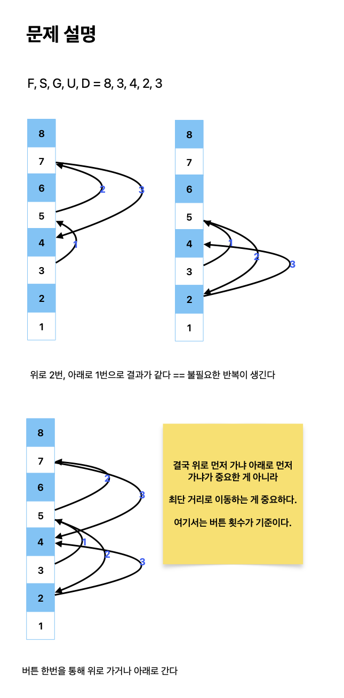

# BFS vs DFS

TL;DR;

- Either BFS or DFS: problems solved by just checking link between nodes.
- BFS: not only checking link but also achieving your goal in the middle of searching.
- DFS: not only checking link but also achieving your goal in the end of searching.

## Either BFS or DFS

> BFS is literally used to search for nodes "Breadth-first" while DFS is used to search for nodes "Depth-first".

In common, they use a tool, "visited", to prevent visiting more than once.

Here are problems that can be solved by either BFS or DFS:

- [안전 영역](https://www.acmicpc.net/problem/2468)
- [빙산](https://www.acmicpc.net/problem/2573)
- [게리멘더링](https://www.acmicpc.net/problem/17471)
- [경주로 건설](https://school.programmers.co.kr/learn/courses/30/lessons/67259?language=python3)

The problems solved by either BFS or DFS are simply required to check link between nodes. That's all.

However, some problems allow you to use only one of them by not only checking link between nodes **but also the searching process**.

## BFS

How does BFS search for nodes "Breadth-first"? The key to BFS is **Queue (First-in First-out)**. By doing so, you can achieve your goal **in the middle of** searching.

```python
from collections import deque

def bfs(graph, src):
  queue = deque([src])
  visited = set([src])

  while queue:
    node = queue.popleft()
    for adj in graph[node]:
      if adj not in visited:
        visited.add(adj)
        queue.append(adj)

```

Here are several problems that must be solved by BFS:

- [스타트링크](https://www.acmicpc.net/problem/5014)
- [맥주 마시면서 걸어가기](https://www.acmicpc.net/problem/9205)
- [샘터](https://www.acmicpc.net/problem/18513)
- [뱀과 사다리 게임](https://www.acmicpc.net/problem/16928)

Let's see 스타트링크:



## DFS

How does DFS search for nodes "Depth-first"? The key to DFS is **Stack (Last-in First-out)**. By doing so, you can achieve your goal **in the end of** searching.

```python
def dfs(graph, src):
  def search(graph, visited, node):
    for adj in graph[node]:
      if adj not in visited:
        visited.add(adj)
        search(graph, visited, node)


  visited = set([src])
  search(graph, visited, node)
```

Here are several problems that must be solved by DFS:

- [빵집](https://www.acmicpc.net/problem/3109)
- [양궁대회](https://school.programmers.co.kr/learn/courses/30/lessons/92342)
- [감시](https://www.acmicpc.net/problem/15683)

Let's see 빵집:

TODO:


## Furthermore

- ~~[What-Else-BFS-Like]()~~
- ~~[What-Else-DFS-Like]()~~
