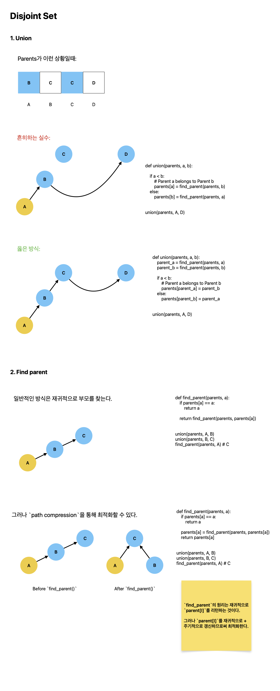

# Disjoint Set

TL;DR;

- Disjoint-set is also known as Union-find.
- Disjoint-set consists of `union` and `find_parent`.
- Disjoint-set models the partitioning of a set.

## What is Disjoint Set?

According to [Wikipedia - Disjoint-set data structure](https://en.wikipedia.org/wiki/Disjoint-set_data_structure):

> In computer science, a disjoint-set data structure, also called a **union–find** data structure or merge–find set, is a data structure that stores a collection of disjoint (non-overlapping) sets.

Disjoint set consists of two functions: union and find_parent. And, it has `parents` to figure out which component belongs to which another component.

So, `parents` acts like a divided `visited` as you see in search algorithms such as `BFS` and `DFS`. i.e. if `parents`' element indicates to not itself but something else, it would set visited by belonging to the element (union performed).

Disjoint set models the partitioning of a set, for example to keep track of the connected components of an undirected graph. Therefore, it is used to detect a cycle, Kruskal’s Minimum Spanning Tree Algorithm, and etc.

## Example

[Baekjoon\_집합의 표현](./Search/b1717.md)



```python

import sys

sys.setrecursionlimit(10**6)
input = sys.stdin.readline

def union(parents, a, b):
    parent_a = find_parent(parents, a)
    parent_b = find_parent(parents, b)

    if a < b:
        # Parent a belongs to Parent b
        parents[parent_a] = parent_b
    else:
        parents[parent_b] = parent_a


def find_parent(parents, a):
    if parents[a] == a:
        return a

    parents[a] = find_parent(parents, parents[a])
    return parents[a]


def solve():
    N, M = map(int, input().split())
    COMMANDS = []
    for _ in range(M):
        COMMANDS.append(list(map(int, input().split())))

    parents = [i for i in range(N + 1)]
    for command in COMMANDS:
        num, a, b = command

        if num == 0:
            union(parents, a, b)
        else:
            # YES OR NO
            if find_parent(parents, a) == find_parent(parents, b):
                print("YES")
            else:
                print("NO")


solve()

```
