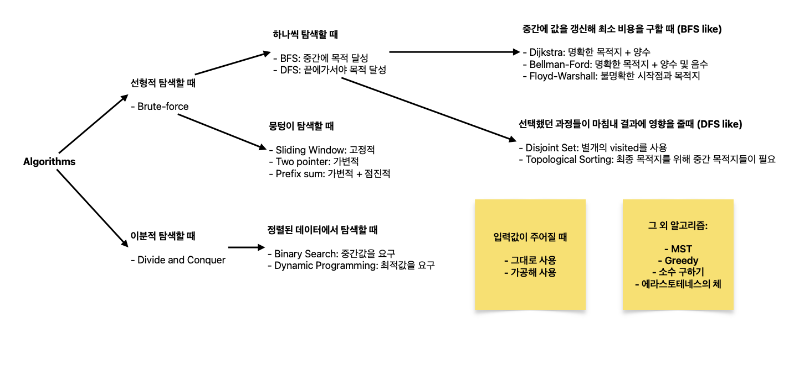

# Introduction to Algorithms

TL;DR;

- Algorithms are largely divided into two parts: _Brute-force_ and _Divide-and-Conquer_.
- You should be used to _Data Structure_ before diving into Algorithms.
- You could unexpectedly run into two errors: _Recursion Error_ and _Timeout Error_.

## Introduction

주어진 시간 내에 문제를 풀기 위해, 문제에서 어떤 특징이 알고리즘으로 연결되는지 알아야 한다. 어떤 문제는 특정 알고리즘만을 유도하지만, 반면에 이 [문제](https://www.acmicpc.net/problem/1939)처럼 어떤 문제는 다양한 알고리즘에 열려있다. 이러한 사실에 유의하여 다양한 문제와 다양한 해결법을 숙지하자.



알고리즘을 들어가기 앞서서 자료구조를 단단히 숙지할 것!

- Stack
- Queue
- Tree
- Graph
- Map
- Set

## Unexpected Error

### 1. Recursion Error

[BOJ Help](https://help.acmicpc.net/judge/rte/RecursionError)

> sys.setrecursionlimit()을 사용하는 것입니다. 이 함수를 사용하면, Python이 정한 최대 재귀 갚이를 변경할 수 있습니다. 소스 1의 최대 재귀 깊이를 1,000,000 정도로 크게 설정하면 런타임 에러 없이 실행이 됩니다.

```python
import sys
sys.setrecursionlimit(10**6)

def calc(n):
    if n == 0: return 0
    else: return n + calc(n-1)

n = int(input())
print(calc(n))
```

### 2. Timeout Error

Input을 읽는 속도가 느려서 때로는 시간 초과 에러가 날 수 있다. 이를 해결하고자 `stdin`을 쓰자

```python
import sys
input = sys.stdin.readline
```

## Furthermore

- [BFS vs DFS](./bfs-vs-dfs.md)
