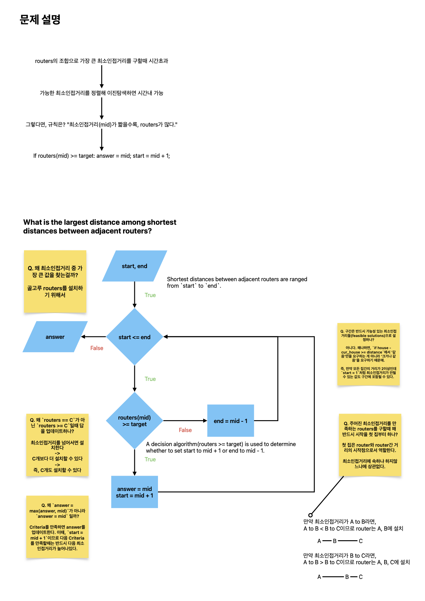

# Parametric Search

TL;DR;

- Parametric search is commonly used in optimization problems.
- Parametric search can be implemented by Binary Search which repeatedly shrinks the interval by calling the decision algorithm.

## What is Parametric Search?

According to [Wikipedia](https://en.wikipedia.org/wiki/Parametric_search)

> "Parametric search is a technique invented for transforming a decision algorithm into an optimization algorithm."
>
> - a decision algorithm (does this optimization problem have a solution with quality better than some given threshold?)
> - an optimization algorithm (find the best solution)

Parametric search is a technique used in algorithm design to find the optimal solution to a problem by searching over a range of parameters or values that define the solution.

Here's how parametric search typically works:

1. Identify the Parameter: First, you need to identify the parameter or parameters that define the solution to the problem. These parameters could be integers, real numbers, or even more complex structures depending on the problem.
1. Define the Search Space: Once you've identified the parameter(s), you need to define the range or space over which you'll search for the optimal solution. This search space should cover all possible values of the parameter(s) that could lead to a valid solution.
1. Perform Binary Search or Similar Technique: Typically, parametric search involves using binary search or a similar technique to efficiently search the parameter space. You iteratively narrow down the search space until you converge to the optimal solution or a solution that satisfies the problem constraints.
1. Check Feasibility: At each step of the search, you need to check whether the current value(s) of the parameter(s) satisfy the problem constraints or conditions. If the current value(s) satisfy the constraints, you update the search space accordingly.
1. Terminate and Return Solution: The search terminates when you've found a solution that meets the problem requirements or when the search space has been sufficiently narrowed down. You then return the optimal value(s) of the parameter(s) as the solution to the problem.

Parametric search is commonly used in a variety of algorithmic problems, including optimization problems, geometric problems, and problems involving scheduling or resource allocation. It's a powerful technique for finding optimal solutions efficiently in a wide range of scenarios.

## Example

According to [Wikipedia](https://en.wikipedia.org/wiki/Parametric_search#Comparison_with_binary_search):

> In [Binary Search\], one maintains an interval of numbers, known to contain the optimal solution value, and repeatedly shrinks the interval by calling the decision algorithm on its median value and keeping only the half-interval above or below the median, depending on the outcome of the call.

Parametric Search can be implemented by Binary Search:



```python
# Baekjoon_2110 공유기 설치
def count_routers(houses, distance):
    count = 1
    cur_house = houses[0]
    for house in houses:
        if house - cur_house >= distance:
            count += 1
            cur_house = house
    return count

def binary_search(houses, start, end, target):
    result = 0
    while start <= end:
        mid = (start + end) // 2
        if count_routers(houses, mid) >= target:
            result = mid
            start = mid + 1
        else:
            end = mid - 1
    return result

if __name__ == "__main__":
    N, C = map(int, input().split())
    houses = [int(input()) for _ in range(N)]
    houses.sort()

    start = 1
    end = houses[-1] - houses[0]
    print(binary_search(houses, start, end, C))

```

## Furthermore

- [~~Dynamic Programming~~]()
